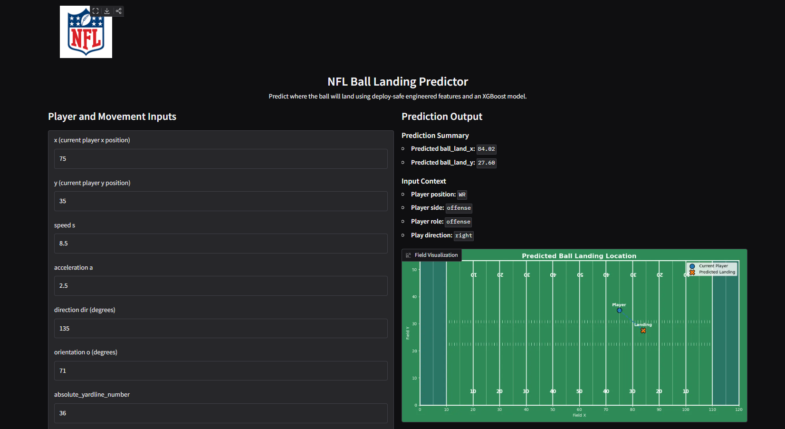

# 🏈 NFL Ball Landing Prediction  
### Big Data Bowl 2026 | End-to-End Machine Learning System

<p align="center">
  
</p>

<p align="center">
  <b>Predicting ball landing position from player tracking data using Machine Learning</b><br>
  Built with XGBoost · Deployed with Gradio · Hosted on Hugging Face Spaces
</p>

<p align="center">
  <a href="https://huggingface.co/spaces/Montanez25/NFL_Player_Tracking_ML_Ball_Landing_Prediction">
    
  </a>
  
  
  
  
</p>

---

## 🚀 Live Demo

👉 **Try the App**  
https://huggingface.co/spaces/Montanez25/NFL_Player_Tracking_ML_Ball_Landing_Prediction

---

## 🧠 Project Overview

This project answers a key question in football analytics:

> **Given player tracking data at a specific moment, where will the ball land?**

Using NFL Big Data Bowl tracking data, this project builds a complete **end-to-end machine learning pipeline**, from raw data to a deployed interactive application.

---

## 🧩 End-to-End Pipeline

```
Raw Tracking Data
        ↓
Feature Engineering (movement + temporal + context)
        ↓
Model Training (Random Forest → XGBoost)
        ↓
Evaluation (MAE, RMSE, R² + error analysis)
        ↓
Deployment (Gradio + Hugging Face Spaces)
```

---

## ⚙️ Key Features

### 📊 Feature Engineering
- Player motion:
  - Speed (`s`)
  - Acceleration (`a`)
  - Direction & orientation
- Temporal dynamics:
  - Previous frame features (`x_prev`, `y_prev`, etc.)
- Context:
  - Player position, role, side
  - Play direction

---

### 🤖 Modeling

| Model            | Purpose        |
|------------------|--------------|
| Random Forest    | Baseline      |
| **XGBoost**      | Final Model   |

- Dual regression targets:
  - `ball_land_x`
  - `ball_land_y`

---

### 📈 Evaluation

- Metrics:
  - MAE
  - RMSE
  - R²
- Analysis:
  - Error distribution
  - Performance by player position

---

## 🎮 Application Features

- Interactive input panel for player tracking variables  
- Real-time ball landing prediction  
- Field visualization including:
  - Player position  
  - Predicted landing location  
  - Trajectory path  
- Preloaded example scenarios  

---

## 📸 Preview

<p align="center">
  
</p>

---

## 📁 Project Structure

```
nfl-big-data-bowl-2026/
│
├── app/                      # Gradio deployment app
│   └── app.py
│
├── models/                   # Deployment-ready models
│   └── final_deploy_xgboost/
│
├── notebooks/                # Full ML workflow
│   ├── 03_feature_engineering_v3.ipynb
│   ├── 04_model_training_v3.ipynb
│   ├── 04_model_training_final_deploy.ipynb
│   └── 05_model_evaluation_v3.ipynb
│
├── src/                      # Reusable pipeline code
│   ├── features.py
│   ├── deploy_features.py
│   └── config.py
│
├── assets/                   # Static assets (logo, images)
├── requirements.txt
└── README.md
```

---

## ⚙️ Installation

```bash
git clone https://github.com/your-username/nfl-big-data-bowl-2026.git
cd nfl-big-data-bowl-2026
python -m venv .venv
```

Activate environment:

```bash
# Windows
.venv\Scripts\activate

# Mac/Linux
source .venv/bin/activate
```

Install dependencies:

```bash
pip install -r requirements.txt
```

---

## ▶️ Run Locally

```bash
cd app
python app.py
```

Open:

```
http://localhost:7860
```

---

## 📊 Results Summary

- XGBoost significantly improved performance over baseline
- Better generalization across player roles
- More stable predictions for nonlinear motion patterns

---

## 💡 Key Learnings

- Feature engineering is critical for spatiotemporal data  
- Capturing motion + context is essential in sports analytics  
- Deployment transforms models into usable products  

---

## 🔮 Future Improvements

- Add prediction uncertainty (confidence intervals)
- Model multi-player interactions
- Sequence-based models (LSTM / Transformers)
- Real-time play simulation
- Integration with live tracking systems

---

## 🧑‍💻 Author

**Jorge Montanez**  
Mechatronics Engineer | AI & Data Science  

- Machine Learning Systems  
- Data Science & Modeling  
- Real-world AI Deployment  

---

## 📜 License

This project is for educational and research purposes as part of the NFL Big Data Bowl.

---

## ⭐ Support

If you found this project interesting:

👉 Give it a ⭐ on GitHub
